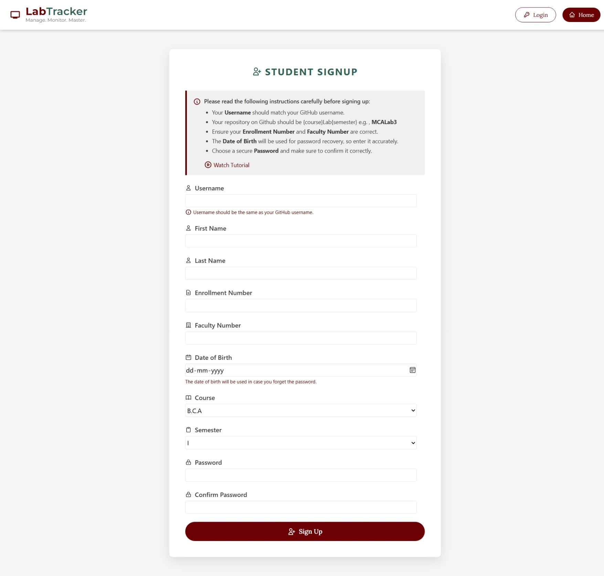
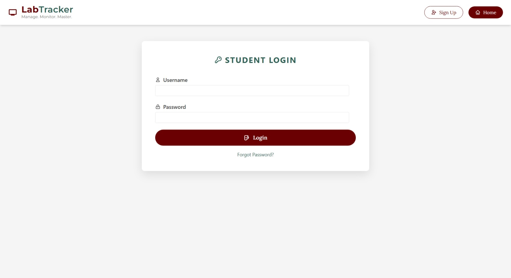

# Lab Tracker - Automating Lab Management using GitHub

Welcome to **Lab Tracker**, a Django-based platform designed to automate and streamline lab management for the Department of Computer Science at AMU. Lab Tracker integrates with GitHub to monitor student progress, assign weekly problems, and generate reports, making lab sessions more efficient and transparent for both students and teachers.

## 🚀 Features

### For Students
- **Sign Up & Login**: Seamless authentication with GitHub username validation.
- **Weekly Progress Tracking**: View assigned problems and submission status for each week.
- **GitHub Integration**: Automatically track problem completion via GitHub repositories.
- **File Generation**: Generate weekly reports and index files for personal tracking.

### For Teachers
- **Problem Management**: Add, edit, and delete weekly problems for students.
- **Student Monitoring**: Review student-specific progress or entire class performance.
- **Automated Reports**: Generate individual or class-wide reports on lab completion.
- **Activity Tracking**: Keep an eye on recent activities by other teachers and students.
- **New Semester Setup**: Easily start a new semester and reset student data.
- **GitHub Data Sync**: Update student repositories and progress automatically using the GitHub API.

### For Admins
- **User Management**: Admin-only features for managing teacher and student accounts.
- **Lab Automation**: Ensure that all labs are updated, tracked, and archived efficiently.

## 🎯 How It Works

1. **Student Sign-Up**: Students sign up with their GitHub username, which is validated to ensure the correct repository exists.
2. **Problem Assignment**: Teachers assign weekly problems to students, which are automatically tracked via their GitHub repository.
3. **Progress Monitoring**: Lab Tracker checks the completion status of problems using GitHub, updating students' dashboards.
4. **Automated Reporting**: Teachers can generate detailed reports for individual students or the entire class, downloadable in various formats.
5. **Continuous Integration**: Lab Tracker periodically updates student progress in batches using a Celery-based task scheduler.

## 🛠️ Tech Stack

- **Backend**: [Django](https://www.djangoproject.com/) (Python)
- **Database**: SQLite (Development) | PostgreSQL (Production)
- **Task Queue**: Celery with Redis for asynchronous background tasks
- **Version Control**: Git and GitHub integration for tracking student lab submissions
- **Frontend**: HTML, CSS (Custom styles), and JavaScript for interactive dashboards

## ⚙️ Setup & Installation

### Prerequisites
- Python 3.x
- Git
- Redis (for Celery tasks)

### Installation Steps

1. Clone the repository:
   ```bash
   git clone https://github.com/your-username/lab-tracker.git
   cd lab-tracker

2. Set up virtual environment:
   ```bash
   python -m venv .venv
   source .venv/bin/activate  # On Windows: .venv\Scripts\activate

3. Install dependencies:
   ```bash
   pip install -r requirements.txt

4. Configure environment variables (create a .env file):
   ```bash
   # Project settings
   DEBUG=True
   SECRET_KEY=supersecretkey123
   DATABASE_URL=your_database_url
   
   # GitHub API
   GITHUB_API_TOKEN=ghp_abc123yourtokenhere
   
5. Run migrations and create a superuser:
   ```bash
   python manage.py migrate
   python manage.py createsuperuser

6. Start the development server:
   ```bash
   python manage.py runserver

7. (Optional) Start the celery worker for automated tasks:
   ```bash
   celery -A labtracker worker -l info


## 📈 Usage

- **Teacher Dashboard**: Teachers can log in and assign problems, track student progress, and generate reports.
  
- **Student Dashboard**: Students can log in to view their assigned problems, track weekly progress, and download reports.
  
- **Admin Panel**: Admins have full control over user management, semester setup, and overall system maintenance.

## 🖼️ Screenshots

### Homepage


### Student Signup


### Student Login


### Teacher Login

## 🎯 Roadmap

- Add OAuth support for GitHub login.
- Implement real-time notifications for problem updates.
- Expand the reporting system with more customizable options.

## 🤝 Contribution

I welcome contributions! Contact me through the profiles available on GitHub for more details.
